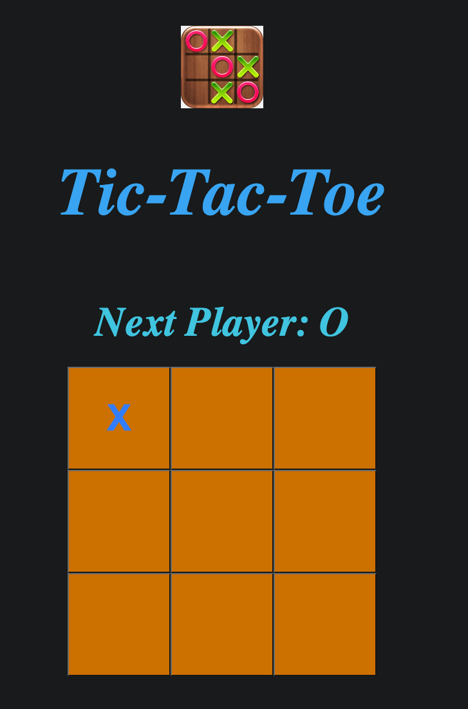

<!-- Title -->

# Tic-Tac-Toe

## Description

This is a simple two player Tic-Tac-Toe (X's and O's) game created using CSS,HTML and React.

I built this project in order to practice and familiarise myself with the basics of React.

## How to Use the Project

The objective of the game is to claim three squares in a row (horizontally, vertically or diagonally) on the gameboard with your token ('X' or 'O').

To play the game the first player, 'X', clicks on any of the nine squares in the game board to claim that square. The second player, 'O', then takes their turn.

Above the gameboard, the player who is up next is shown. When the game is over, the winner will be declared above the gameboard.

